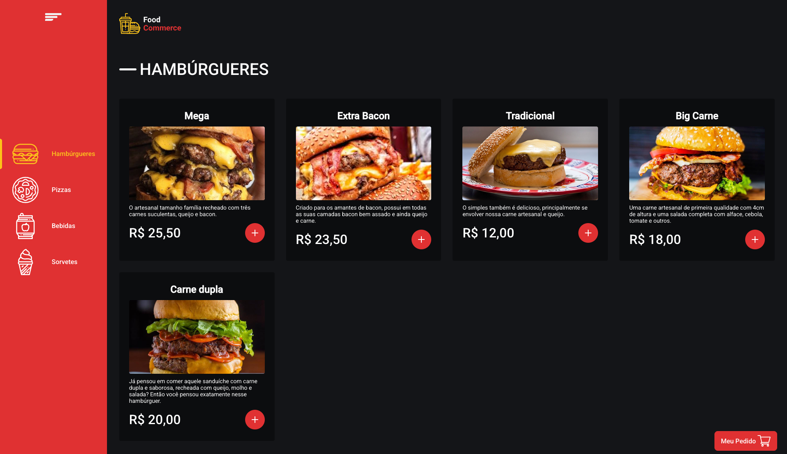
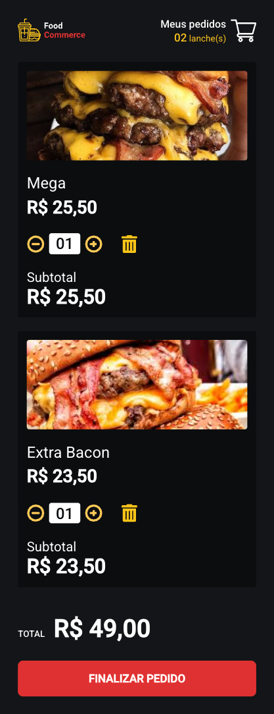

# 🍔 Food Commerce - Plataforma de Pedido Online


Uma aplicação moderna de delivery de comida que simula a experiência completa de um e-commerce. O projeto foi desenvolvido com foco em performance, tipagem rigorosa com TypeScript e uma interface totalmente responsiva.

---

## 📸 Demonstração

| Página Principal | Carrinho e Checkout |
| :---: | :---: |
|  |  |


---

## ✨ Funcionalidades

* **Cardápio Dinâmico:** Consumo de dados via API simulada para listagem de hambúrgueres, pizzas, bebidas e sobremesas.
* **Gestão de Carrinho:** Adição, remoção e atualização de quantidades com cálculo de subtotal em tempo real.
* **Feedback Visual:** Implementação de *Skeletons* para estados de carregamento (UX).
* **Fluxo de Pagamento:** Formulário de checkout completo com validações e simulação de envio de pedido.
* **Responsividade:** Layout adaptado para dispositivos móveis e desktop.

---

## 🛠️ Tecnologias e Ferramentas

* **Framework:** React.js (Hooks e Context API)
* **Linguagem:** TypeScript (Interfaces e Tipagem Estática)
* **Estilização:** Styled Components
* **Requisições:** Axios
* **Backend (Mock):** JSON Server

---

## 🚀 Como Executar o Projeto

Este projeto utiliza uma arquitetura separada para o Frontend e para o "Banco de Dados" (JSON Server). Siga os passos abaixo:

### 1. Clonar e Instalar
```bash
git clone [https://github.com/juanndev/Plataforma-de-Pedido-Online.git](https://github.com/juanndev/Plataforma-de-Pedido-Online.git)
cd Plataforma-de-Pedido-Online
npm install
```

### 2. Configurar Variáveis de Ambiente
```bash

Crie um arquivo .env na raiz do projeto:
REACT_APP_API_BASE_URL=http://localhost:3004
```

### 3. Rodar o Banco de Dados (Terminal 1)
```bash

É necessário subir a API para que os produtos apareçam na tela:
npx json-server --watch db.json --port 3004
```
#### 4. Rodar o Frontend (Terminal 2)
```bash

Em uma nova aba do terminal, inicie a aplicação:
npm start

Acesse http://localhost:3000 para visualizar o projeto.
```
---